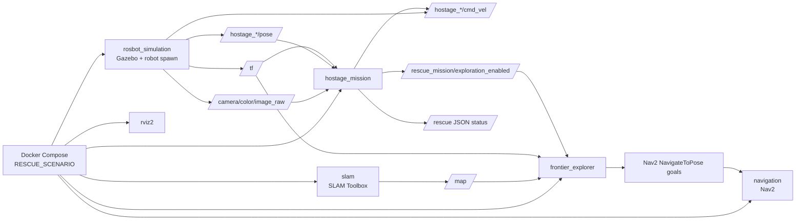
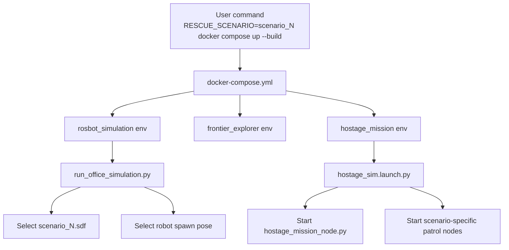
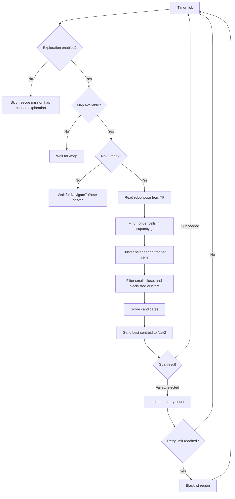
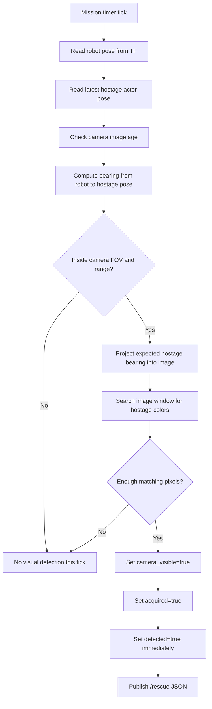
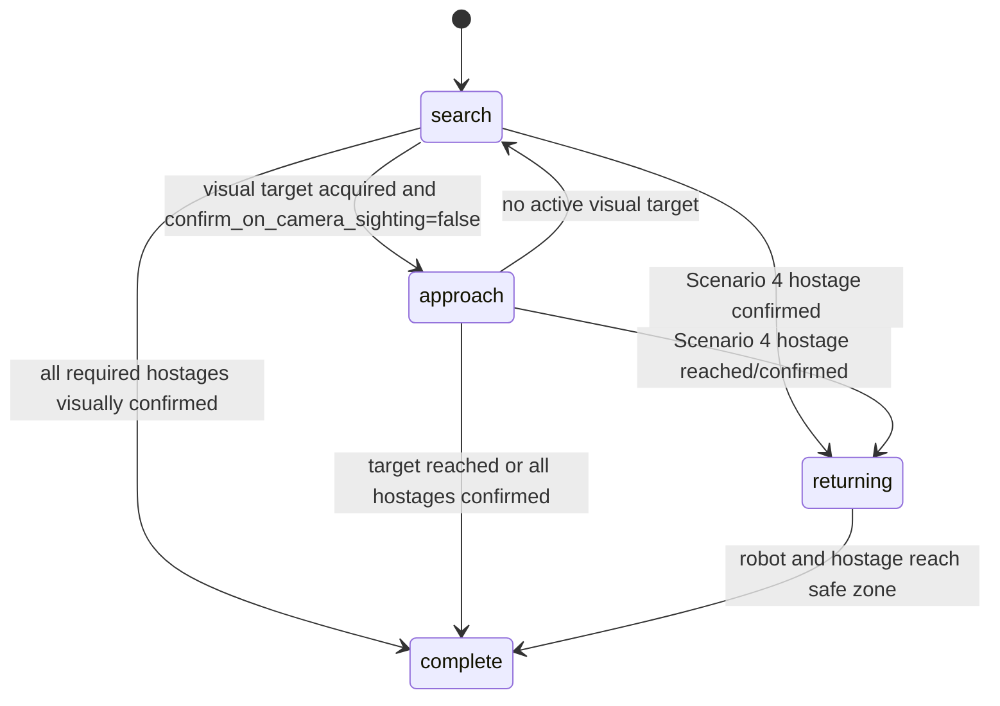
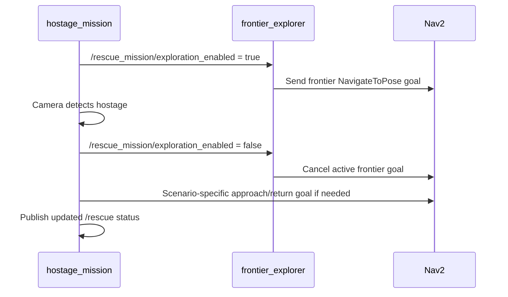
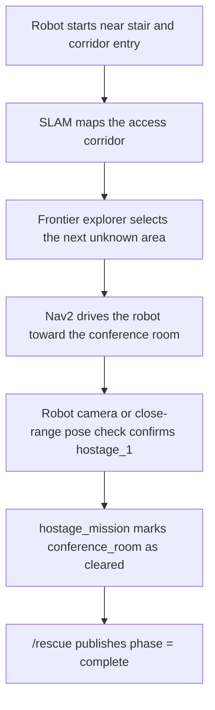
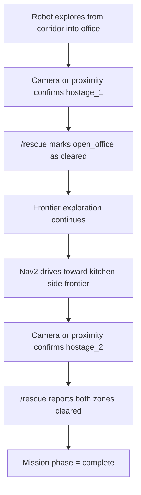
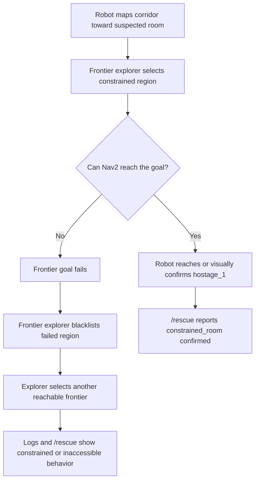
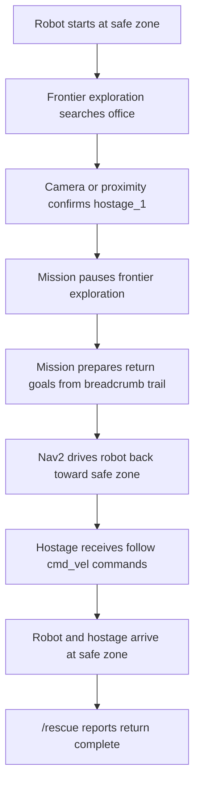

# Rescue Scenario Demo Technical Brief

This document summarizes the rescue demo implementation for presentation planning. It explains the system workflow, ROS nodes, algorithms, scenario behavior, and demo commands.

## System Overview

The system is a ROS 2 rescue simulation built around a Husarion ROSbot operating in a Gazebo office environment. The robot starts from a scenario-specific location, uses SLAM to build a map, uses frontier exploration to choose where to search next, and uses Nav2 to drive through the environment.

Hostages are represented as Gazebo actors with ROS-facing pose and velocity topics. The rescue mission node monitors the robot camera and actor pose topics, confirms hostages when they are visually detected, and publishes structured mission status on `/rescue`. In the fourth scenario, the mission continues after detection by returning the robot to a safe zone while commanding the hostage actor to follow.

The whole demo is selected with one environment variable, `RESCUE_SCENARIO`, so the same Docker Compose workflow can launch different worlds, hostage layouts, robot start poses, and mission behaviors.

## Demo Goal

The project demonstrates an autonomous rescue reconnaissance workflow in a Gazebo office environment:

1. Spawn a ROSbot in one of four rescue scenarios.
2. Build a map with SLAM while exploring unknown space.
3. Use frontier exploration to select Nav2 goals.
4. Detect hostage actors through the robot camera.
5. Publish rescue status on `/rescue`.
6. For Scenario 4, guide the located hostage back to the safe zone.

## How To Run

Each scenario is selected through the `RESCUE_SCENARIO` environment variable.

```bash
RESCUE_SCENARIO=scenario_1 docker compose up --build
RESCUE_SCENARIO=scenario_2 docker compose up --build
RESCUE_SCENARIO=scenario_3 docker compose up --build
RESCUE_SCENARIO=scenario_4 docker compose up --build
```

Useful inspection commands:

```bash
docker compose exec hostage_mission ros2 topic echo /rescue
docker compose logs -f frontier_explorer
docker compose logs -f hostage_mission
docker compose down
```

## High-Level Architecture



## Main Components

| Component | Container / Package | Responsibility |
| --- | --- | --- |
| Gazebo simulation | `rosbot_simulation` | Loads selected SDF world, robot, office models, hostage actors, and Gazebo bridges. |
| Scenario selector | `src/launch/run_office_simulation.py` | Maps `RESCUE_SCENARIO` to world file and robot spawn pose. |
| SLAM | `slam` | Builds `/map` from robot sensor data. |
| Nav2 | `navigation` | Executes navigation goals through `NavigateToPose`. |
| Frontier explorer | `frontier_explorer` | Selects autonomous exploration goals from the map frontier. |
| Hostage mission | `hostage_sim/hostage_mission_node.py` | Tracks mission state, detects hostages with camera input, publishes `/rescue`, and coordinates exploration pause/return behavior. |
| Hostage actor controller | `hostage_actor_controller.cpp` | Gazebo system plugin that receives `/hostage_*/cmd_vel` and publishes `/hostage_*/pose`. |
| Hostage patrol | `hostage_patrol_node.py` | Optional actor movement controller; Scenario 1 moves the hostage back and forth. |
| RViz | `rviz2` | Displays map, robot state, Nav2 data, and the robot camera view. |

## Scenario Selection Workflow

`RESCUE_SCENARIO` controls three parts of the demo:

- which SDF world Gazebo loads
- where the robot starts
- which hostages and mission behavior are configured



## Scenario Summary

| Scenario | World file | Hostages | Main behavior | Expected result |
| --- | --- | ---: | --- | --- |
| Scenario 1: Priority Hostage Room Clearance | `scenario_1.sdf` | 1 | Explore toward conference room; camera confirms hostage immediately on sight. | Conference-room hostage is confirmed and `/rescue` reports cleared zone. |
| Scenario 2: Multi-Room Hostage Sweep | `scenario_2.sdf` | 2 | Continue frontier exploration until both office and kitchen-side hostages are visually confirmed. | Both hostages are reported in one mission. |
| Scenario 3: Constrained-Access Rescue Validation | `scenario_3.sdf` | 1 | Adds static blockers near the suspected hostage route to exercise Nav2 failure and frontier blacklisting. | Robot either confirms the hostage or shows that the region is constrained/inaccessible. |
| Scenario 4: Guide Hostage Back | `scenario_4.sdf` | 1 | Explore until visual confirmation, then return to safe zone and command hostage to follow. | Robot and hostage return to the safe zone. |

Current actor placements:

| Scenario | Actor | Approx. pose |
| --- | --- | --- |
| `scenario_1` | `hostage_1` | `(8.00, -6.25)` conference room |
| `scenario_2` | `hostage_1` | `(2.60, -9.17)` open office |
| `scenario_2` | `hostage_2` | `(12.20, -1.80)` kitchen-side area |
| `scenario_3` | `hostage_1` | `(12.55, -1.55)` constrained room |
| `scenario_4` | `hostage_1` | `(12.20, -1.80)` kitchen-side area |

Scenario 3 adds blockers named `Scenario3_Blocker_A`, `Scenario3_Blocker_B`, and `Scenario3_Blocker_C`.

## Frontier Exploration Algorithm

The `frontier_explorer` node autonomously expands the map by driving toward frontiers. A frontier is a free known cell that touches an unknown cell in the occupancy grid.

### Frontier Loop



### Frontier Cell Rule

A grid cell is treated as a frontier when:

- occupancy is known and below `occupancy_threshold`
- at least one neighboring cell is unknown (`-1`)

### Clustering

The node groups frontier cells using breadth-first search. The configured connectivity is 8-neighbor clustering, so diagonal frontier cells are part of the same cluster.

Each `FrontierCluster` stores:

- grid cells in the cluster
- centroid in world coordinates
- distance from robot
- local clearance estimate
- final score

### Scoring

The node prefers frontiers that are large, locally open, and not too far away:

```text
score = (size ^ frontier_size_weight * clearance ^ frontier_clearance_weight)
        / ((distance + 1.0) ^ frontier_distance_weight)
```

Configured defaults in `src/config/frontier_params.yaml`:

| Parameter | Value | Meaning |
| --- | ---: | --- |
| `frontier_connectivity` | `8` | Use diagonal neighbors while clustering. |
| `min_frontier_size` | `20` | Ignore tiny frontier clusters. |
| `occupancy_threshold` | `50` | Treat cells above this as occupied. |
| `goal_tolerance` | `0.9` | Ignore goals already close to robot. |
| `retry_limit` | `1` | Blacklist a failed region after one failed goal. |
| `frontier_blacklist_radius` | `1.2` | Radius used to group failed frontier regions. |
| `frontier_size_weight` | `1.5` | Reward larger frontier clusters. |
| `frontier_clearance_weight` | `2.0` | Reward open areas over narrow clutter. |

## Hostage Detection Algorithm

Detection is handled by `hostage_mission_node.py`. It combines:

- robot pose from TF
- actor pose from `/hostage_*/pose`
- camera image from `/camera/color/image_raw`
- color-based visual detection in the expected target region

The mission now confirms a hostage as soon as the camera sees it.

### Detection Flow



### Camera Detection Details

The detector looks for color groups associated with the hostage model:

- green sweater
- blue jeans
- skin tones

Important parameters:

| Parameter | Current value | Meaning |
| --- | ---: | --- |
| `camera_image_topic` | `/camera/color/image_raw` | Robot camera image topic. |
| `camera_frame_horizontal_fov` | `1.3962634` rad | Approx. 80 degree horizontal FOV. |
| `camera_detection_range` | `10.0` m | Maximum actor-pose range considered for camera detection. |
| `camera_image_timeout` | `1.0` s | Reject stale camera frames. |
| `camera_detection_pixel_threshold` | `8` | Minimum matching pixels for visual confirmation. |
| `confirm_on_camera_sighting` | `true` | Mark hostage detected as soon as camera sees it. |

## Mission State Machine

The mission node publishes high-level status on `/rescue` and coordinates exploration with `/rescue_mission/exploration_enabled`.



Current default behavior:

- Scenarios 1-3 continue frontier-driven search until hostage visual confirmation.
- Visual confirmation immediately marks the hostage as detected.
- Scenario 4 switches to return behavior after detection.

## `/rescue` Status Topic

The main output topic is:

```text
/rescue
type: std_msgs/msg/String
payload: JSON
```

Typical fields:

```json
{
  "scenario": "scenario_1",
  "phase": "complete",
  "hostages": [
    {
      "id": "hostage_1",
      "zone": "conference_room",
      "acquired": true,
      "detected": true,
      "camera_visible": true,
      "camera_pixel": {"x": 320, "y": 210},
      "pose": {"x": 8.0, "y": -6.25, "z": 0.0}
    }
  ],
  "cleared_zones": ["conference_room"],
  "safe_zone": null,
  "robot_pose": {"x": 5.3, "y": -6.8},
  "message": "All hostage locations confirmed.",
  "detection_method": "camera_color_image",
  "active_target": null
}
```

## Exploration Pause / Resume Coordination

The mission node can pause frontier exploration by publishing:

```text
/rescue_mission/exploration_enabled
type: std_msgs/msg/Bool
```

Behavior:

- `true`: frontier explorer is allowed to select and send exploration goals.
- `false`: frontier explorer skips its timer loop and cancels any active frontier goal.

This is most important when the mission is approaching a visual target or returning to the safe zone.



## Hostage Actor Movement

Gazebo actor motion is handled through a custom plugin:

- publishes actor pose on `/hostage_*/pose`
- subscribes to velocity commands on `/hostage_*/cmd_vel`
- applies simple commanded motion to the actor

Scenario 1 also starts `hostage_patrol_node.py`, which commands `hostage_1` to walk back and forth between two nearby points in the conference room.

## Scenario Workflows

### Scenario 1: Priority Hostage Room Clearance

Goal: verify a high-priority hostage in the conference room.



Expected presentation point: the robot does not need physical contact. Camera confirmation is enough to clear the room.

### Scenario 2: Multi-Room Hostage Sweep

Goal: find two hostages in one continuous mission.



Expected presentation point: `/rescue` aggregates all hostage statuses and cleared zones.

### Scenario 3: Constrained-Access Rescue Validation

Goal: demonstrate behavior around cluttered or blocked access.



Expected presentation point: failure is handled as useful information. The robot can either find an alternate route or demonstrate that human intervention may be needed.

### Scenario 4: Guide Hostage Back

Goal: locate a hostage and return to the safe zone.



Expected presentation point: Scenario 4 adds a post-detection rescue phase instead of stopping at identification.

## Logging For Debugging

Important log streams:

```bash
docker compose logs -f hostage_mission
docker compose logs -f frontier_explorer
docker compose logs -f rosbot_simulation
```

`hostage_mission` logs:

- current phase
- robot pose
- actor pose
- camera visibility
- bearing to target
- color pixel count
- active approach/return goal state
- whether frontier exploration is enabled

`frontier_explorer` logs:

- map and Nav2 readiness
- frontier cell and cluster counts
- top candidate frontiers
- active Nav2 frontier goal
- goal success/failure
- blacklist events
- pause/resume events from the mission node

## Presentation Takeaways

- The demo combines SLAM, frontier exploration, Nav2 navigation, Gazebo actors, and camera-based target confirmation.
- Scenario selection is environment-driven, making all demos launch with the same command shape.
- Frontier exploration handles the search phase without scripted waypoints.
- Hostage detection is camera-gated and publishes structured JSON status for responders.
- Scenario 3 demonstrates recovery behavior around inaccessible regions.
- Scenario 4 extends detection into a rescue-guidance workflow by returning to a safe zone with the hostage following.
